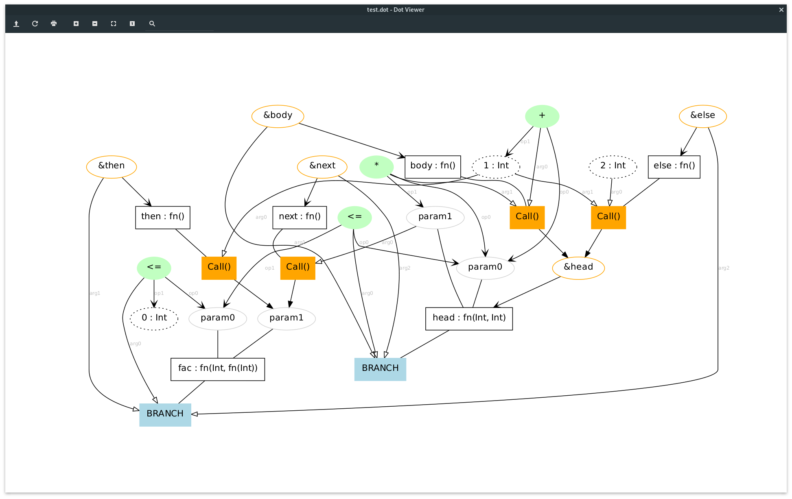
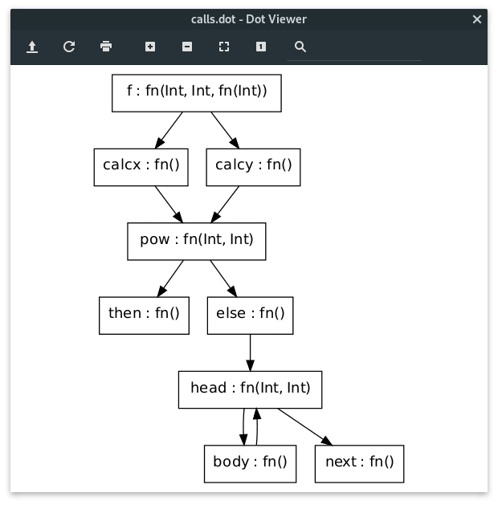

# Khorin

A literal (as much as practical) Kotlin transcription of the 2015 paper "[A  Graph-Based  Higher-Order  Intermediate  Representation](https://compilers.cs.uni-saarland.de/papers/lkh15_cgo.pdf)" from Leissa et al.

Thorin is a graph-based intermediate representation for computer programs, suited to both imperative-style and functional programs.

## Purpose

This is an educational project for learning about the fine details of Thorin's approach to IR and transformations. This project tries to stay faithful and close to the paper's description, and avoids much of the complexity in the real production Thorin. 

Per this educational angle, Khorin comes with a number of helpful test cases re-creating the examples of the paper, and can generate graph visualizations in the DOT format

## IR graph

A 1:1 representation of the nodes in the IR

### Nodes legend

 * Continuation heads are rectangles
 * Filled boxes are continuation bodies
   * Orange ones are calls
   * Blue ones are intrinsics (branch etc)
 * Orange-outlined ellipses are references to continuations ("Abstractions" as called in Fig. 4 of the paper)
 * Grey ellipses are the parameters for continuations
 * Teal filled ellipses are primops
 * Dotted ellipses are literals

### Edges legend

 * V-shaped arrows represent a data dependency
 * Empty arrows represent the arguments for continuation bodies
 * Full arrows indicate control flow
 * Edges without symbols indicate the relation between a continuation and it's parameters/body

Edges are labelled when appropriate to indicate which operand/argument they correspond to

## Call Graph

